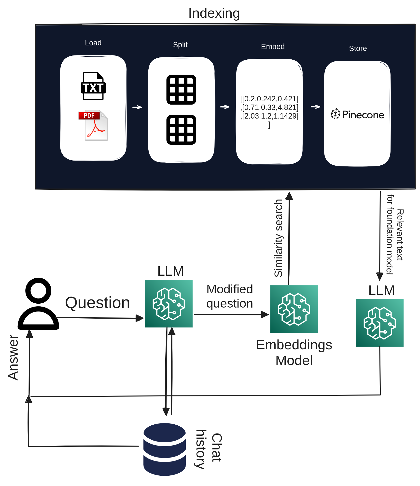
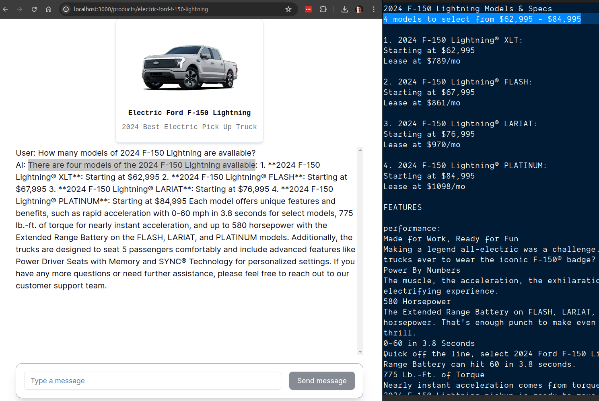

## Project Bootrap

[project set up](./project-bootstrap.md)

## Multitenant RAG

**Two flows:**

### 1. Indexing(digestion):

<p align="center">

</p>

Front End:
Add product Page

```bash
httt://localhost:3000/products/add
```

`src/app/products/add/page.tsx`  
Client Component(Upload form)

- `src/components/doc-upload-form.tsx`  
  Server Action:
  - `src/lib/actions/product.ts`
  - form schema validation
  - Slugifying name
  - Upload doc and img to s3(presigned url)
  - Create product in DB schema(Prisma)
  - Embed doc File

**Embed Doc File**  
[`src/lib/pinecone-utils.ts`](src/lib/pinecone-utils.ts)

### 2. Chat(retrieving)

<p align="center">

</p>

Flow starts at `src/app/products/[slug]/page.tsx` Product chat page  
Heavy lifting is done by <ChatSection> 'client component'

To integrate an LLM with a Next.js app, particularly when dealing with a chat screen that sends and receives responses from a LangChain chain, you need to follow a specific process. Here’s how it works:

1. **Client Component**: The chat screen must be a client component because it will utilize various React hooks, including the `useChat` hook.

2. **useChat Hook**: The `useChat` hook is responsible for sending user messages (prompts) to a route handler. This handler is where the LangChain Retrieval-Augmented Generation (RAG) Runnable resides.

3. **Message Handling**: When a user sends a message, the `useChat` hook packages the message history, including the latest chat message, and sends it to the route handler.

4. **RAG Chain Process**:

   - The RAG chain receives the prompt message along with the message history.
   - It performs a semantic search to gather relevant context based on the prompt.
   - The RAG then combines the prompt message with the retrieved context and uses this information to feed the Language Model (LLM).

5. **Streaming Response**: The LLM processes the input and generates a response stream.

6. **UI Update**: The `useChat` hook or an AI SDK UI component knows how to convert the response stream into text, which is then displayed directly in the chat screen as the LLM’s response.
